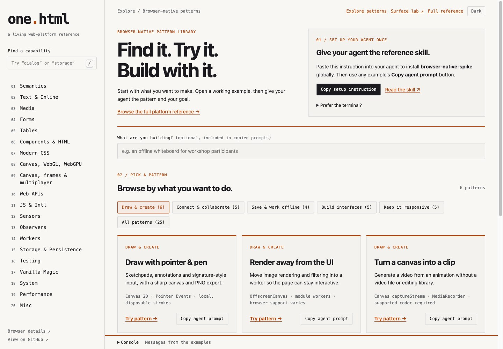

# one.html

**A living web-platform reference, in one HTML file.**

**[Open the live demo](https://chriswhawkins.github.io/one.html/)** · [Surface lab](https://chriswhawkins.github.io/one.html/proofs/) · [Runtime lab](https://chriswhawkins.github.io/one.html/proofs/runtime.html)



*Start with a pattern, try it in the browser, then copy an instruction for your agent.*

This started as a long-running kitchen sink for the web platform: HTML, CSS, JavaScript, browser APIs, hardware access, storage, graphics, AI, accessibility, and whatever comes next.

More recently, I’ve found it useful as a compact, working body of examples that constrains coding agents toward modern, browser-native solutions instead of generic framework-shaped answers.

It’s not intended to be a framework, component library, or canonical implementation. It’s a maintained reference: working examples of what the platform itself can do right now.

## Browse the reference

- Start in **Explore patterns**: 25 selected patterns grouped by what you want to build. Search or choose a category to narrow them down.
- Select **Try pattern** for a focused demonstration. The full reference keeps the older examples and their source available.
- Add your goal and select **Copy agent prompt** to carry the pattern, source pointers, requirements and verification steps into your agent.
- Use **Surface lab** for complete portability, collaboration and rendering proofs; use **Runtime lab** for SQLite, Python and transport experiments.
- Browse the numbered sections for the full platform reference. Press `/` to search, `Escape` to clear, and open **Browser details** or **Console** for detection and example output.

## Run it

No install or build step. From this directory:

```sh
python3 -m http.server 8000 --bind 127.0.0.1
```

Open [localhost:8000](http://localhost:8000/). Opening `index.html` directly works for some examples; use localhost or HTTPS for secure-context APIs, modules, and service workers. Browser, OS, hardware, permissions, and experimental flags affect what runs. Detection badges indicate API presence or accepted syntax, not guaranteed behavior; cross-browser tags are rough notes, not a compatibility promise.

Storage examples read and modify this origin’s browser storage. Use a dedicated local port or origin when experimenting; clear buttons affect the whole origin. The report editor saves to IndexedDB and caches its shell for offline use. Its imported rich text preserves basic formatting but strips attributes and unsupported elements. Hardware access and other permission-sensitive demonstrations run from their controls. The abort demo contacts httpbin.org; the Cache API demo fetches the URL you enter. Speech recognition may use a browser vendor’s remote service. Built-in AI demonstrations depend on browser-provided models.

## What lives here

- [`index.html`](index.html): the main reference, with inline styles, scripts, generated media, search, and feature detection.
- [`sw.js`](sw.js): the opt-in offline demo. Service workers require a separate served resource.
- [`editor/`](editor/index.html): a report-editing spike derived from the reference, with its own service worker. It demonstrates local editing and an operation log; it is not a production editor or multi-user sync system. [`report-editor.html`](report-editor.html) forwards to it.
- [`AGENTS.md`](AGENTS.md): guidance for working on this repository.
- [`skills/browser-native-spike/SKILL.md`](skills/browser-native-spike/SKILL.md): reusable guidance for building browser-native prototypes elsewhere.

## Work through complete proofs

Open the [Surface lab](proofs/index.html) for editable HTML export, real WebRTC peer sessions, versioned agent commands, streamed HTML, HTML-in-Canvas and codec/device checks. It is linked from the pattern explorer and retains per-proof agent prompts. The [runtime lab](proofs/runtime.html) adds worker-based SQLite/Python and transport measurements.

Optional pairing, streaming and WebSocket echo use `python3 proofs/server.py --port 8765`, then open [localhost:8765/proofs/](http://localhost:8765/proofs/). See [requirements and verified limits](proofs/README.md). The [roadmap](docs/next-proofs.md) tracks experiments that need physical devices, external infrastructure or installed browser capabilities.

## Use it with an agent

On the live demo, select **Copy setup instruction** and paste it into your agent once. It installs the reusable `browser-native-spike` skill globally. Then choose an example and copy its agent prompt.

If you prefer the terminal, with Node.js installed:

```sh
npx skills add chriswhawkins/one.html --skill browser-native-spike --global
```

Choose your agent when prompted. You can also copy [`skills/browser-native-spike/`](skills/browser-native-spike/) into your agent’s supported skills directory manually. The skill consults the current reference instead of duplicating its examples. A local checkout or commit-pinned copy works for offline use and reproducibility.

## Live hosting

The demo uses **GitHub Pages**, publishing the root of `main`. Merged changes publish automatically; `.nojekyll` keeps the HTML and support files unchanged. No build step, runtime server, deployment token or paid service is required. See [GitHub Pages setup](https://docs.github.com/en/pages/getting-started-with-github-pages/creating-a-github-pages-site).

| Available on the public demo | Requires another environment |
| --- | --- |
| Reference, editor, portable HTML export/import, manual WebRTC pairing and local command inspector | Link-based pairing, delayed HTML streaming and the bundled WebSocket echo need `proofs/server.py`. |
| SQLite/Python workers, OPFS snapshots and codec checks in supporting browsers | Runtime packages download from their pinned CDNs. WebTransport needs a supplied endpoint. |
| Feature detection and ordinary DOM fallbacks | Native WebMCP and HTML-in-Canvas need a compatible experimental browser. Screen capture and hardware APIs need support and permission; cross-network peers may need STUN/TURN. |

The hosted demo is a static reference, not a hosted collaboration backend. [Verification results and device limits](proofs/README.md) distinguish tested behavior from follow-on experiments.

## Keep it small

Add useful examples, fix incorrect ones, and document meaningful limitations. Keep native HTML, CSS, and JavaScript inspectable; preserve older examples unless they are wrong. Supporting files are fine where the platform needs them. Let real experiments drive organization rather than designing a taxonomy in advance.

The notebook layout uses system fonts, plain text, and native controls. Keep its navigation useful as the collection grows. [`docs/screenshot.jpg`](docs/screenshot.jpg) is a documentation asset; update it when the page’s appearance changes.
